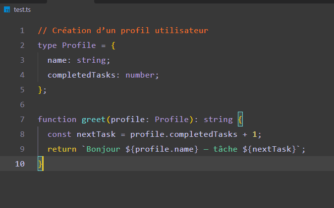

# DysCoder Universal Theme

[English version](README.en.md)

DysCoder Universal est un thème Visual Studio Code conçu pour rendre le code plus simple à parcourir, à repérer et à lire sur la durée.

Il s'adresse notamment aux développeurs dyslexiques, avec TDAH, ou à toute personne qui préfère une interface structurée, contrastée et moins chargée visuellement.



## Ce que propose DysCoder

- Une palette sombre anthracite reposante (`#383838`).
- Une couleur stable par rôle de code : mots-clés, fonctions, types, chaînes, nombres, variables et commentaires.
- Une hiérarchie visuelle claire : mots-clés, fonctions, classes, balises HTML et propriétés CSS sont renforcés en gras.
- Des commentaires orange faciles à retrouver sans les confondre avec le code.
- Des guides d'indentation progressifs pour mieux suivre les blocs imbriqués.
- Une prise en charge universelle basée sur les règles génériques de VS Code, complétée pour HTML, CSS et les langages les plus utilisés.

## Installation

### Depuis Visual Studio Code Marketplace

1. Ouvrez Visual Studio Code.
2. Ouvrez l'onglet Extensions avec `Ctrl+Shift+X`.
3. Recherchez `DysCoder Universal Theme`.
4. Installez l'extension.
5. Ouvrez la palette de commandes avec `Ctrl+Shift+P`.
6. Lancez `Preferences: Color Theme`.
7. Sélectionnez **DysCoder Universal**.

## Police recommandée : OpenDyslexic

Le thème fonctionne avec toutes les polices monospace. Pour une expérience de lecture pensée pour la dyslexie, nous recommandons d'essayer [OpenDyslexic](https://opendyslexic.org/).

1. Téléchargez puis installez OpenDyslexic depuis son site officiel.
2. Dans VS Code, ouvrez `Ctrl+Shift+P` puis lancez `Preferences: Open User Settings (JSON)`.
3. Ajoutez la police à vos réglages :

```json
{
  "editor.fontFamily": "OpenDyslexic, Consolas, monospace"
}
```

Si cette police ne vous convient pas, utilisez celle avec laquelle votre lecture est la plus confortable. DysCoder ne l'impose pas.

## Profil DysCoder — Lecture

Le thème change les couleurs. Le profil de lecture ajoute des réglages facultatifs pour aérer l'éditeur et faciliter la navigation dans les gros projets :

- taille de police `16` ;
- interligne `28` ;
- léger espacement des caractères ;
- minimap désactivée ;
- ligne active et guides d'indentation visibles ;
- dossiers de l'Explorateur non compactés ;
- indentation de l'arborescence augmentée ;
- fil d'Ariane activé.

Le fichier [`profiles/DysCoder-Reading.settings.json`](profiles/DysCoder-Reading.settings.json) contient ces réglages. Vous pouvez en copier tout ou partie dans vos préférences VS Code. Ils restent optionnels : chaque personne doit pouvoir garder sa propre façon de travailler.

## Compatibilité

DysCoder est conçu pour fonctionner dans un maximum de langages grâce aux catégories de syntaxe communes de VS Code. Il est notamment testé au fil du développement avec :

- TypeScript et JavaScript ;
- Python ;
- HTML et CSS ;
- PHP ;
- SQL ;
- JSON ;
- Java.

## Retour et amélioration

Le thème est construit à partir de situations réelles de lecture de code. Si une couleur manque de contraste, si un langage est difficile à distinguer ou si un élément se fond dans le reste, ouvrez une issue sur le [dépôt GitHub](https://github.com/Jo0ker64/DysCoderTheme/issues).

## Licence

Distribué sous la **Joeker Labs Community License (JLCL) v1.0**.

Copyright © 2026 Joeker Labs. Tous droits réservés. Consultez le fichier [LICENSE](LICENSE) pour les conditions complètes.
